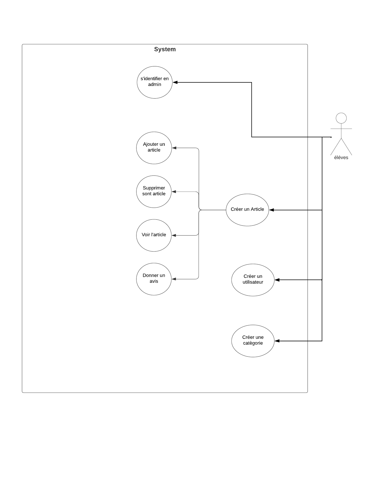

---
runme:
  id: 01HTY8G03JE7J3PZRGHBNKWMCH
  version: v3
---

# Blog lycée fulbert

Le Lycée Fulbert vise à encourager l'apprentissage continu et la collaboration entre ses élèves en fournissant une plateforme où ils peuvent partager leurs connaissances et leurs expériences en informatique.

En tant qu'étudiant en BTS SIO effectuant un projet au sein du Lycée Fulbert, je suis chargé de développer une plateforme de partage de connaissances en informatique pour les élèves. Mon blog serait un élément central de cette plateforme, offrant aux élèves un espace où ils peuvent publier des articles, des tutoriels, des projets, etc., pour enrichir l'apprentissage mutuel et favoriser une culture de collaboration.

### Pré-requis

Avant de commencer, assurez-vous d'avoir les éléments suivants installés sur votre système :

- PHP 8.2
- Composer 2.5.8
- Symfony CLI
- vagrant debian 10

### VM Vagrant

Utiliser la VM debian/bullseye64

```sh {"id":"01HVGX5GF3S9GF940YTRF3K5QX"}
vagrant init debian/bullseye64
vagrant up
vagrant ssh
```

Apache2

```sh {"id":"01HVGXZFP1ZYB3QSP43S3ES331"}
sudo apt update
sudo apt install apache2
sudo systemctl status apache2 
sudo apt install curl
```

BDD mariadb

```sh {"id":"01HVGY1EE64TGFNS2YHXDWJAE0"}
su -  # mdp:vagrant
apt install mariadb-server mariadb-client -y
mysql
CREATE USER 'paul'@'%' IDENTIFIED BY 'paul';
GRANT ALL PRIVILEGES ON * . * TO 'paul'@'%';
FLUSH PRIVILEGES;
CREATE DATABASE blog;
exitS

```
sudo nano /etc/mysql/mariadb.conf.d/50-server.cnf
bind-address = 0.0.0.0

### Installation

1. Clonez ce dépôt sur votre machine :

```sh {"id":"01HTYEME90HE8NQ66Q8BWDZYRX"}
git clone https://github.com/ologate/blog_V3.git
```

2. Installez les dépendances

```sh {"id":"01HTYEP56H82MCPR15WDJQ03JR"}
composer install
```

3. Lancer le serveur :

```sh {"id":"01HTYEQ8J840V101XS8W083PYR"}
symfony server:start
```

4. Créer la base de données :

```sh {"id":"01HTYERYC8NG8DQ79JJJ2G6XD9"}
php bin/console make:migration 
```

5. Créer les tables :

```sh {"id":"01HTYEVHTZHAEYTQ0K9DSC2S7M"}
 php bin/console doctrine:migrations:migrate
```

6. Charger les données de test :

```sh {"id":"01HTYEWBSZFCBCPBYXC0JX11N7"}
php bin/console doctrine:fixtures:load
```

7. Ouvrez votre navigateur.

```sh {"id":"01HTYEWZ1F5MPWNA1A1CC9QV8V"}
symfony open:local
```

## Use case



## ULM


## Mettre des images du blog quand il sera finit ici !!!!!!!!!!!!!!!!!!!!!!!!!!!!!!!!!!!!!!!!!!!!!!!!


## Fabriqué avec

symfony


## Versions

V1

